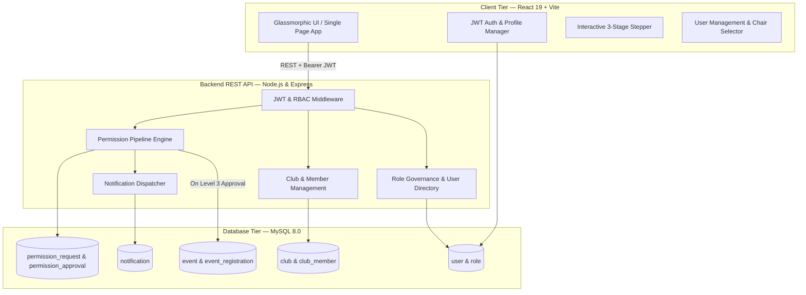
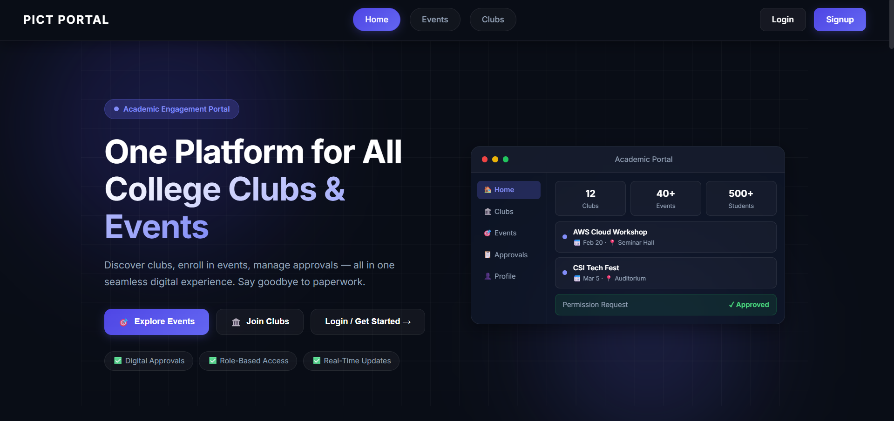
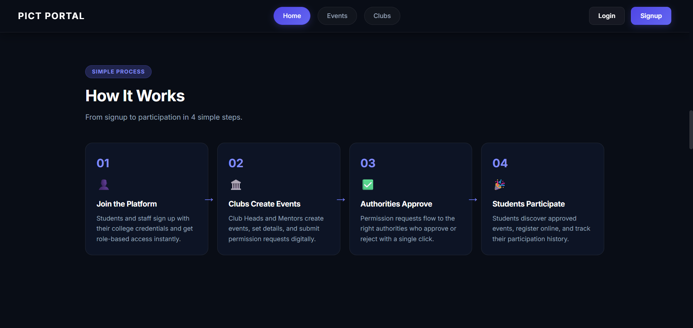
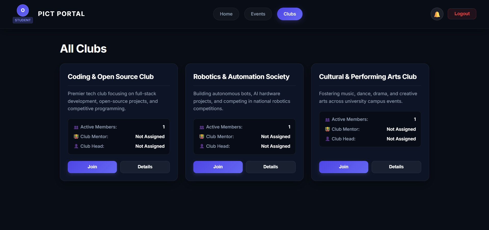
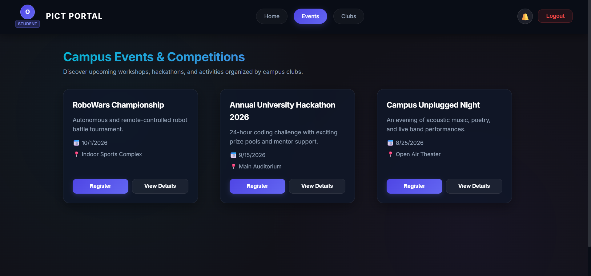
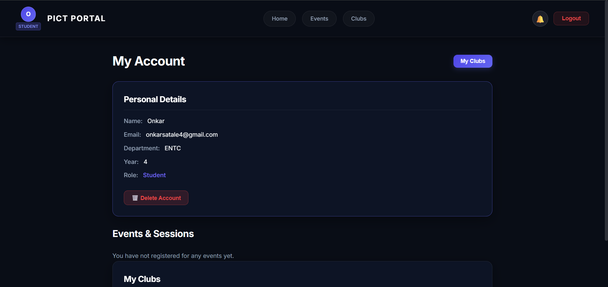
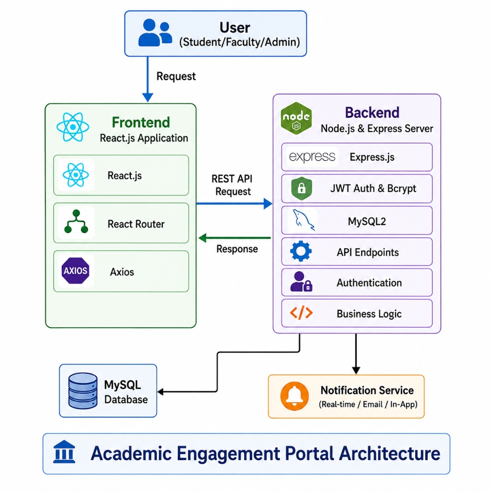

# 🎓 Academic Engagement Portal – Campus Club, Event & Multi-Tier Permission Ecosystem

[](https://academic-engagement-portal-kappa.vercel.app/)
[](https://academic-engagement-portal-backend.onrender.com/)
[](https://react.dev/)
[](https://vitejs.dev/)
[](https://nodejs.org/)
[](https://www.mysql.com/)
[](https://jwt.io/)
[](https://opensource.org/licenses/MIT)

**Academic Engagement Portal** is a production-ready, full-stack campus engagement and institutional governance platform designed for colleges and universities. It digitizes club operations, event administration, and institutional permissions through a **3-tier sequential approval workflow** across campus leadership. Built with modern React 19, Vite, Node.js/Express, and MySQL, the portal features real-time in-app notifications, strict career-track role barriers, single-chair executive management, and automated event publishing.

---

## 🌐 Live Deployments

| Service | Platform | Live URL |
| :--- | :--- | :--- |
| **Frontend Application** | Vercel | [https://academic-engagement-portal-kappa.vercel.app/](https://academic-engagement-portal-kappa.vercel.app/) |
| **Backend API Gateway** | Render | [https://academic-engagement-portal-backend.onrender.com/](https://academic-engagement-portal-backend.onrender.com/) |

---

## 🚀 Key System Features

### 🏛️ 1. 3-Tier Hierarchical Permission & Approval Workflow
- **Sequential Authority Review:** Event permission requests automatically progress through three verified review tiers:
  1. **Level 1 — Club Mentor:** Academic alignment, club validity, and preliminary sanction.
  2. **Level 2 — Estate Manager:** Campus facility booking, venue availability, and logistics verification.
  3. **Level 3 — Principal (Final Authority):** Executive sanction, safety review, and final approval.
- **⚡ Automatic Event Publication:** Upon Level 3 (Principal) approval, the backend automatically creates and publishes the event to the public **Events Catalog**, triggering a campus-wide notification.
- **📝 Audit Logs & Historical Remarks:** Reviewers record granular remarks and timestamps at every level, visible to higher authorities and the requesting Club Head.
- **🔄 Edit & Resubmit:** If rejected at any stage, Club Heads can modify event details and resubmit, seamlessly archiving the previous attempt and restarting the approval pipeline.
- **🚫 Request Withdrawal with Broad Notification:** Club Heads can cancel active requests mid-pipeline; all involved authorities up to that review stage receive an instant cancellation notification.

---

### 👥 2. Role-Based Access Control (RBAC) & Governance Architecture
- **7 Distinct User Roles:**
  1. `Student` (Role ID: 1) — Explore clubs, apply for memberships, RSVP to events.
  2. `Teacher` (Role ID: 2) — Faculty member eligible for club mentorship or executive chairs.
  3. `Admin` (Role ID: 3) — Institutional system administrator with user management & chair allocation.
  4. `Club Head` (Role ID: 4) — Student leader managing club activities, members, and event permission submissions.
  5. `Club Mentor` (Role ID: 5) — Faculty mentor conducting Level 1 permission reviews.
  6. `Estate Manager` (Role ID: 6) — Campus facility authority conducting Level 2 venue reviews.
  7. `Principal` (Role ID: 7) — Head of institution conducting Level 3 final approvals.
- **🔒 Strict Career-Track Isolation:** Enforces hard boundary checks between the **Student Track** (`Student`, `Club Head`) and the **Faculty Track** (`Teacher`, `Club Mentor`, `Estate Manager`, `Principal`, `Admin`), preventing privilege escalation across tracks.
- **🪑 Single-Chair Executive Seat Management:** Dynamic reallocation of single-holder executive seats (`Principal`, `Estate Manager`, `Admin`) with automatic role handoff and executive transition alerts for outgoing holders.

---

### 🎪 3. Club Ecosystem & Student Membership Lifecycle
- **Club Directory:** Browse clubs by categories (Technical, Cultural, Sports, Social, etc.) with detailed profiles and activity logs.
- **Application Workflow:** Students submit join requests with custom statements; Club Heads review, approve, or reject applicants with instant status feedback.
- **Enrolled Clubs Portal:** Students track their club affiliations and pending applications in a unified view.

---

### 📅 4. Event Lifecycle & RSVP Management
- **Centralized Event Showcase:** Displays upcoming and past campus events with venue, date, organizer info, and real-time registered student counts.
- **Student Event Registration:** Verified students RSVP with one-click enrollment forms, eliminating duplicate registrations at database and API levels.
- **My Events Dashboard:** Personalized student dashboard displaying all upcoming registered events with direct access to details.

---

### 🔔 5. Real-Time In-App Notification Engine
- Instant notifications for permission advancement, rejections with remarks, membership approvals, request withdrawals, and campus-wide event releases.
- Read/unread tracking, notification counter badges in the navigation bar, and deep-linking directly to relevant approval dashboards or event pages.

---

### 🛡️ 6. Enterprise-Grade Security & Reliability
- **Stateless JWT Bearer Auth:** Secure access and refresh tokens paired with `bcryptjs` password hashing.
- **Input Sanitization & Typo Detection:** RFC-compliant email validation with intelligent typo correction suggestions (e.g., `@gail.com` ➔ `@gmail.com`).
- **API Hardening:** `helmet` security headers, `express-rate-limit` DDoS prevention, CORS allowlisting, and parameterized SQL queries to eliminate SQL injection.

---

## 🧠 System Architecture & Workflow



---

## 📸 Application Showcase

| Landing Page | Interactive How It Works |
| :---: | :---: |
|  |  |

| Campus Clubs Directory | Live Events Catalog |
| :---: | :---: |
|  |  |

| Account & Role Management | Architecture Overview |
| :---: | :---: |
|  |  |

---

## 📂 Repository Structure

```
Academic-Engagement-Portal/
├── assets/                     # UI screenshots and architecture diagrams
├── backend/                    # Node.js + Express REST API Server
│   ├── config/                 # MySQL database connection pool (db.js)
│   ├── controllers/            # Auth, Club, Event, Permission, User & Feedback controllers
│   ├── database/               # Relational SQL schema (schema.sql)
│   ├── middlewares/            # JWT verification, RBAC auth, rate limiting & error handling
│   ├── models/                 # Data access layer (Club, Event, Permission, User, Role models)
│   ├── routes/                 # API endpoint routing definitions
│   ├── services/               # Business logic (Permission pipeline, Club, User & Event services)
│   ├── utils/                  # ApiError helper, logger, and utility functions
│   ├── validators/             # Request payload validation rules (express-validator)
│   ├── app.js                  # Express middleware setup & route mounting
│   └── server.js               # HTTP server entrypoint
└── frontend/                   # React.js SPA (Vite)
    ├── public/                 # Static assets & index.html
    └── src/
        ├── api/                # Axios instance configuration & JWT interceptors
        ├── auth/               # Login & Register components with email typo validation
        ├── components/         # ApprovalDashboard, MyRequestsList, PermissionRequestForm, Navbar, etc.
        ├── pages/              # HomePage, Clubs, ClubDetails, Events, EventDetails, Account, etc.
        ├── App.js              # React Router v7 routes & global notification wrappers
        ├── index.css           # Global modern glassmorphic styling & design tokens
        └── main.jsx / index.js # React application mount point
```

---

## 🛠️ Tech Stack

| Tier | Technology | Purpose |
| :--- | :--- | :--- |
| **Frontend** | React 19, React Router v7, Vite 6, Axios, React Toastify | High-performance Single Page Application with dynamic dashboards & responsive UI |
| **Backend** | Node.js (ESM), Express.js, Express Validator, Helmet | Secure REST API Gateway, permission pipeline engine, rate limiting |
| **Database** | MySQL Server 8.0+ | Relational data persistence with foreign keys, indexing, and cascading constraints |
| **Authentication** | JWT (JSON Web Tokens), bcryptjs | Stateless authorization with access/refresh token rotation |
| **Deployment** | Vercel (Frontend), Render (Backend) | Continuous integration and production cloud hosting |

---

## ⚙️ Environment Configuration

Create `.env` files in both the `backend` and `frontend` directories before running the application locally.

### 1. Backend Configuration (`backend/.env`)
```env
PORT=5000
NODE_ENV=development
ALLOWED_ORIGINS=http://localhost:3000,http://localhost:5173
FRONTEND_URL=http://localhost:3000
DB_HOST=localhost
DB_PORT=3306
DB_USER=root
DB_PASSWORD=your_mysql_password
DB_NAME=college_db
JWT_ACCESS_SECRET=your_jwt_secret_key_here
JWT_ACCESS_EXPIRES_IN=7d
JWT_REFRESH_SECRET=your_jwt_refresh_secret_key
JWT_REFRESH_EXPIRES_IN=30d
```

### 2. Frontend Configuration (`frontend/.env`)
```env
REACT_APP_API_URL=http://localhost:5000/api
REACT_APP_WEB3FORMS_KEY=your_optional_web3forms_key
```

---

## 🚀 Local Installation & Setup

### Prerequisites
- **Node.js**: v18.x or v20.x+
- **npm**: v9.x or higher
- **MySQL Server**: v8.0 or higher running on port `3306`

---

### Step-by-Step Setup

#### 1️⃣ Clone the Repository
```bash
git clone https://github.com/Onkar-Satale/Academic_Engagement_Portal.git
cd Academic_Engagement_Portal
```

#### 2️⃣ Initialize Database Schema
Import the relational schema into your MySQL instance:
```bash
mysql -u root -p < backend/database/schema.sql
```

#### 3️⃣ Setup & Run Backend Server
```bash
cd backend
npm install
npm run dev
```
> *Backend API server will run at:* `http://localhost:5000`

#### 4️⃣ Setup & Run Frontend Client
In a separate terminal:
```bash
cd frontend
npm install
npm run dev
```
> *Frontend React application will run at:* `http://localhost:3000` (or `http://localhost:5173`)

---

## 📡 API Endpoints Summary

### 🔐 Authentication & Accounts
- `POST /api/auth/register` — Register a new student or faculty account.
- `POST /api/auth/login` — Authenticate credentials and receive access/refresh tokens.
- `GET /api/users/profile` — Fetch current user profile and role details.
- `DELETE /api/users/profile` — Delete personal user account.

### 👑 User Governance & Administration
- `GET /api/users/all` — Retrieve all registered users across roles (Admin only).
- `PUT /api/users/:id/role` — Update a user's role with track boundary validation (Admin only).
- `DELETE /api/users/:id` — Delete a user from the directory (Admin only).
- `GET /api/users/authority-seats` — Fetch current executive chair holders (Principal, Estate Manager, Admin).
- `POST /api/users/authority-seats` — Reassign executive chair holders with auto-transition.

### 🏛️ Campus Clubs & Memberships
- `GET /api/clubs` — Retrieve list of all active campus clubs.
- `GET /api/clubs/:id` — Retrieve detailed club profile, active members, and mentor information.
- `POST /api/clubs` — Create a new campus club entity (Admin only).
- `PUT /api/clubs/:id` — Update club description, activities, or leadership (Club Leadership/Admin).
- `POST /api/clubs/:id/join` — Submit a club membership application (Students only).
- `GET /api/clubs/my/enrolled` — Retrieve all clubs the active student is enrolled in.

### 📋 3-Tier Permissions & Approvals
- `POST /api/permissions` — Submit a new event permission request (Club Head only).
- `GET /api/permissions/my-requests` — Retrieve real-time permission status, progress stepper, and remarks history.
- `GET /api/permissions/pending` — Fetch pending requests matching the current authority's review level.
- `POST /api/permissions/:requestId/action` — Approve or Reject a permission request with written remarks.
- `DELETE /api/permissions/:requestId` — Cancel/withdraw a permission request and notify involved authorities.

### 📅 Events & Registrations
- `GET /api/events` — Retrieve published upcoming and past campus events.
- `GET /api/events/:id` — Retrieve event details and registered student counts.
- `POST /api/event-registrations/register` — Register student attendance for an event (Students only).
- `GET /api/event-registrations/my` — Fetch events registered by the active student.

### 🔔 Notifications & Feedback
- `GET /api/notifications` — Retrieve all user notifications.
- `PUT /api/notifications/:id/read` — Mark a notification as read.
- `POST /api/feedback` — Submit user feedback/testimonials.

---

## 🤝 Contributing

Contributions, issues, and feature requests are welcome!

1. Fork the repository
2. Create your feature branch (`git checkout -b feature/amazing-feature`)
3. Commit your changes (`git commit -m 'Add amazing new feature'`)
4. Push to the branch (`git push origin feature/amazing-feature`)
5. Open a Pull Request

---

## 📄 License

Distributed under the **MIT License**. See `LICENSE` for more information.

---

## 👨‍💻 Author & Maintainer

- **Onkar Satale**
- **GitHub:** [@Onkar-Satale](https://github.com/Onkar-Satale)
- **LinkedIn:** [Onkar Satale](https://www.linkedin.com/in/Onkar-Satale)
- **Email:** [onkarsatale4@gmail.com](mailto:onkarsatale4@gmail.com)
- **Repository:** [Academic_Engagement_Portal](https://github.com/Onkar-Satale/Academic_Engagement_Portal)
